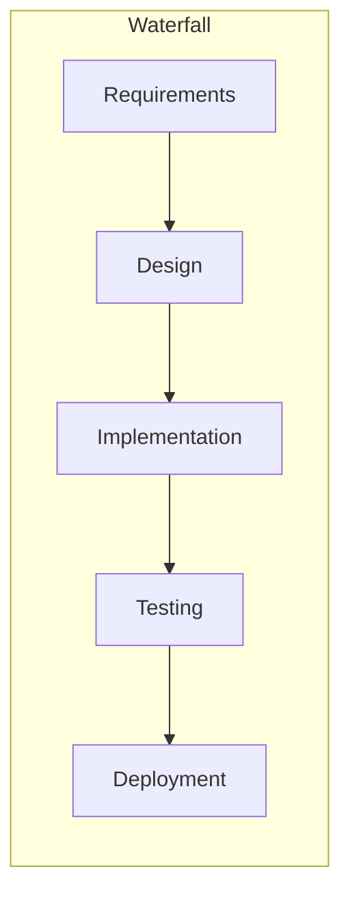
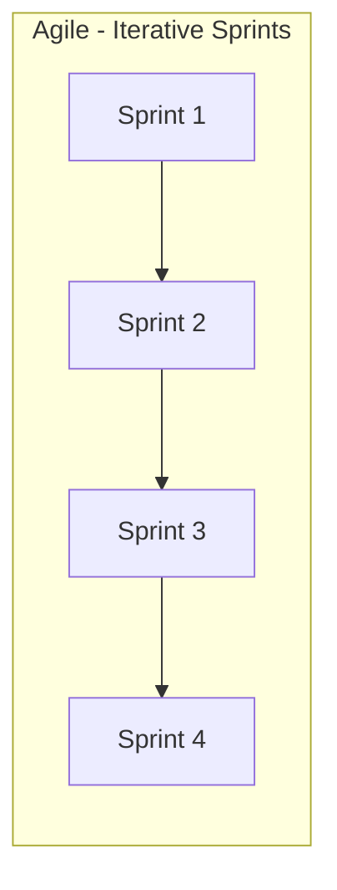
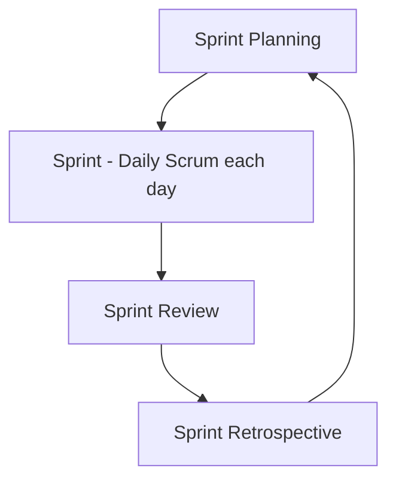
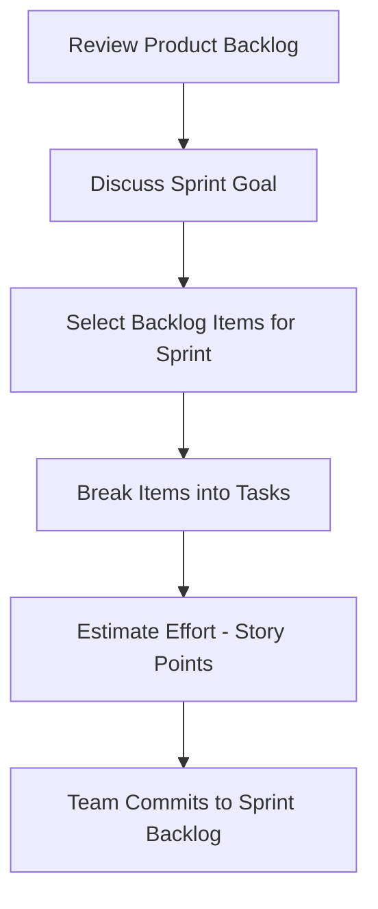
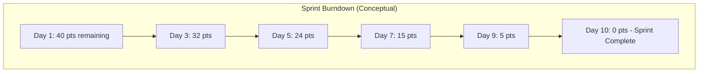

# 🏃 Agile & Scrum Guide

A complete guide to Agile principles, the Scrum framework, estimation techniques, and writing effective user stories.

---

## 📑 Table of Contents

- [Introduction to Agile & Agile Manifesto](#introduction-to-agile--agile-manifesto)
- [Scrum Framework – Roles, Ceremonies & Artifacts](#scrum-framework--roles-ceremonies--artifacts)
- [Agile Estimation & Story Points](#agile-estimation--story-points)
- [Agile Planning Techniques](#agile-planning-techniques)
- [Agile User Stories](#agile-user-stories)
- [References](#references)

---

## Introduction to Agile & Agile Manifesto

### Overview of Agile Principles and Values

Agile is an iterative approach to software development and project management that emphasizes flexibility, collaboration, and delivering working software in small, incremental cycles rather than one large release at the end. Instead of trying to plan everything upfront, Agile teams adapt continuously based on feedback, changing requirements, and real-world learning.

### Agile Manifesto – 4 Values & 12 Principles

The Agile Manifesto was created in 2001 by a group of software practitioners to define a lightweight alternative to heavyweight, plan-driven development processes.

**The 4 Core Values:**

| Value | Over |
|---|---|
| Individuals and interactions | Processes and tools |
| Working software | Comprehensive documentation |
| Customer collaboration | Contract negotiation |
| Responding to change | Following a plan |

> Note: Items on the right still have value — but Agile prioritizes the items on the left.

**The 12 Principles (summarized):**

1. Satisfy the customer through early and continuous delivery of valuable software
2. Welcome changing requirements, even late in development
3. Deliver working software frequently (weeks rather than months)
4. Business people and developers must work together daily
5. Build projects around motivated individuals and trust them
6. Face-to-face conversation is the most efficient form of communication
7. Working software is the primary measure of progress
8. Promote sustainable development at a constant pace
9. Continuous attention to technical excellence and good design
10. Simplicity — maximizing the amount of work not done — is essential
11. The best architectures and designs emerge from self-organizing teams
12. Teams regularly reflect on how to become more effective and adjust accordingly

### Agile vs Waterfall





| Aspect | Waterfall | Agile |
|---|---|---|
| Approach | Linear, sequential | Iterative, incremental |
| Flexibility | Rigid — changes are costly | Highly flexible — embraces change |
| Customer Involvement | Mainly at the start and end | Continuous, throughout the project |
| Delivery | One final delivery at the end | Frequent, working increments |
| Testing | After implementation phase | Throughout every iteration |
| Best Suited For | Well-defined, stable requirements | Evolving or unclear requirements |
| Risk | Discovered late | Identified and mitigated early |

---

## Scrum Framework – Roles, Ceremonies & Artifacts

Scrum is the most widely used Agile framework. It organizes work into fixed-length iterations called **Sprints**, typically 1–4 weeks long.

### Scrum Roles

| Role | Responsibility |
|---|---|
| **Product Owner** | Owns the product vision, manages and prioritizes the Product Backlog, represents stakeholder/customer interests |
| **Scrum Master** | Facilitates the Scrum process, removes blockers/impediments, coaches the team on Agile practices, shields the team from distractions |
| **Development Team** | Cross-functional group that designs, builds, and tests the product increment each Sprint |

### Scrum Ceremonies (Events)



| Ceremony | Purpose | Typical Duration |
|---|---|---|
| **Sprint Planning** | Team selects backlog items and plans the work for the upcoming Sprint | 2–4 hrs (for a 2-week sprint) |
| **Daily Scrum (Standup)** | Short daily sync — what was done, what's next, any blockers | 15 minutes |
| **Sprint Review** | Team demos the completed increment to stakeholders for feedback | 1–2 hrs |
| **Sprint Retrospective** | Team reflects on what went well/poorly and identifies improvements | 1–1.5 hrs |

### Scrum Artifacts

| Artifact | Description |
|---|---|
| **Product Backlog** | A prioritized, evolving list of everything that might be needed in the product — features, fixes, tech debt |
| **Sprint Backlog** | The subset of Product Backlog items selected for the current Sprint, plus the plan to deliver them |
| **Increment** | The sum of all completed backlog items at the end of a Sprint — a usable, potentially shippable product version |

### Definition of Done

The **Definition of Done (DoD)** is a shared, agreed-upon checklist that defines when a piece of work is truly complete — for example: code written, peer-reviewed, tested, documented, and merged. It ensures consistency and quality across the team and prevents "hidden" unfinished work from being considered complete.

---

## Agile Estimation & Story Points

### Story Points Concept

Story points are a relative, unit-less measure used to estimate the overall effort, complexity, and uncertainty involved in completing a user story — rather than estimating in hours or days. Teams commonly use a modified Fibonacci sequence (1, 2, 3, 5, 8, 13, 21...) since it reflects the natural uncertainty in estimating larger items.

### Planning Poker Technique

Planning Poker is a consensus-based, gamified estimation technique:

1. The Product Owner reads a user story aloud
2. Each team member privately selects a card representing their estimate (story points)
3. All cards are revealed simultaneously
4. If estimates differ significantly, the highest and lowest estimators explain their reasoning
5. The team discusses and re-estimates until consensus is reached

This approach reduces anchoring bias (where the first spoken number influences everyone else) and encourages discussion that surfaces hidden complexity.

---

## Agile Planning Techniques

### Sprint Planning Process



Sprint Planning typically answers two key questions:
- **What** can be delivered in this Sprint's increment?
- **How** will the chosen work get done?

### Velocity and Burndown Charts

**Velocity** measures the average amount of work (in story points) a team completes per Sprint. It's calculated over several Sprints and used to forecast how much work a team can realistically take on in future Sprints.

**Burndown Chart** is a visual representation of work remaining versus time within a Sprint (or Release). It helps the team track progress toward the Sprint Goal at a glance.



---

## Agile User Stories

### What is a User Story?

A user story is a short, simple description of a feature or requirement written from the perspective of the end user. It focuses on the value delivered rather than technical implementation details, and serves as the starting point for a conversation between the team and stakeholders.

### Format

```
As a [type of user],
I want [an action/goal],
so that [a benefit/value].
```

**Example:**
> As a registered user, I want to reset my password, so that I can regain access to my account if I forget it.

### INVEST Principle

A good user story should be **INVEST**-able:

| Letter | Meaning | Description |
|---|---|---|
| **I** | Independent | Can be developed and delivered without depending on other stories |
| **N** | Negotiable | Details can be discussed and refined — it's not a rigid contract |
| **V** | Valuable | Delivers clear value to the user or customer |
| **E** | Estimable | The team can reasonably estimate the effort involved |
| **S** | Small | Small enough to be completed within a single Sprint |
| **T** | Testable | Has clear criteria to verify it's been implemented correctly |

### Acceptance Criteria – Writing Effective Criteria (Given-When-Then)

Acceptance criteria define the specific conditions a user story must satisfy to be considered complete. The **Given-When-Then** format (from Behavior-Driven Development) is a common way to write them clearly:

```
Given [initial context/state],
When [an action is performed],
Then [expected outcome occurs].
```

**Example (for the password reset story above):**
```
Given a registered user is on the login page,
When they click "Forgot Password" and enter a valid email,
Then a password reset link is sent to their email within 2 minutes.
```

### Writing User Stories in Practice

- Keep stories focused on **user value**, not implementation details
- Write stories collaboratively with the whole team, not just the Product Owner
- Break large stories ("epics") into smaller, sprint-sized stories
- Always pair a story with clear acceptance criteria before development starts
- Use real user language — avoid technical jargon where possible
- Revisit and refine stories continuously as understanding improves (backlog grooming/refinement)

---

## 📚 References

- [GeeksforGeeks – What is Agile Methodology?](https://www.geeksforgeeks.org/software-testing/what-is-agile-methodology/)
- [Atlassian – Agile](https://www.atlassian.com/agile)
- [GeeksforGeeks – Agile Methodology Tutorial](https://www.geeksforgeeks.org/software-engineering/agile-methodology-tutorial/)
- [GeeksforGeeks – What is Scrum?](https://www.geeksforgeeks.org/software-engineering/what-is-scrum/)
- [Atlassian – Scrum](https://www.atlassian.com/agile/scrum)
- [Atlassian – Beginner's Guide to Scrum and Agile Project Management](https://www.atlassian.com/blog/project-management/beginners-guide-scrum-and-agile-project-management)
- [TutorialsPoint – Planning Poker](https://www.tutorialspoint.com/estimation_techniques/estimation_techniques_planning_poker.htm)
- [Mountain Goat Software – Planning Poker](https://www.mountaingoatsoftware.com/agile/planning-poker)
- [freeCodeCamp Guide – Planning Poker](https://guide.freecodecamp.org/agile/planning-poker)
- [GeeksforGeeks – User Stories in Agile Software Development](https://www.geeksforgeeks.org/software-engineering/user-stories-in-agile-software-development/)
- [Atlassian – User Stories](https://www.atlassian.com/agile/project-management/user-stories)
- [freeCodeCamp – How to Write User Stories for Beginners](https://www.freecodecamp.org/news/how-to-write-user-stories-for-beginners)
- [GeeksforGeeks – What is Acceptance Criteria & How to Write It](https://www.geeksforgeeks.org/product-management/what-is-acceptance-criteria-how-to-write-it/)

---

