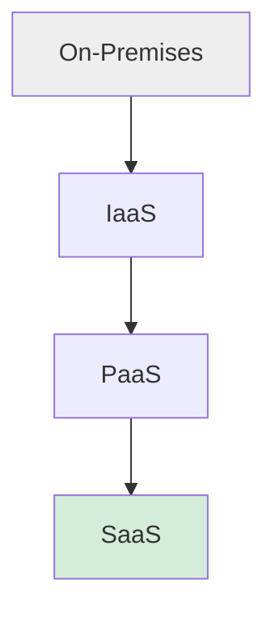
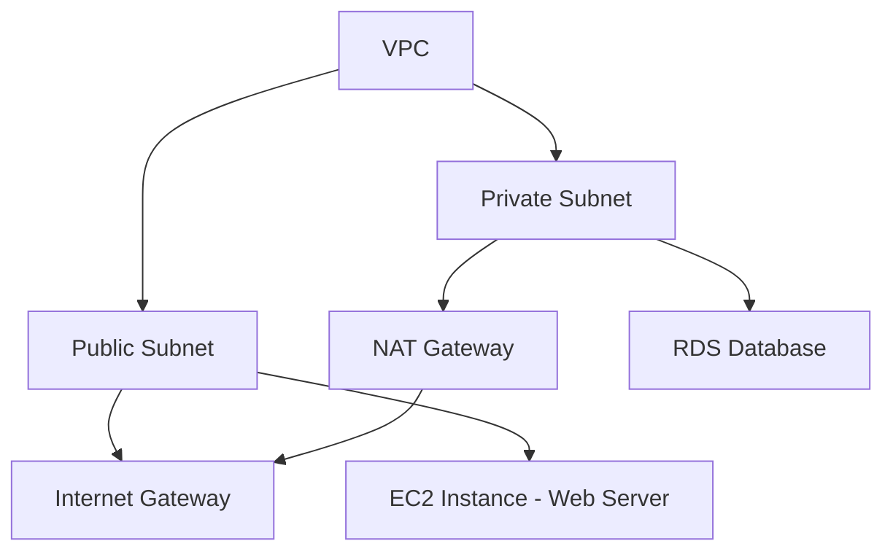
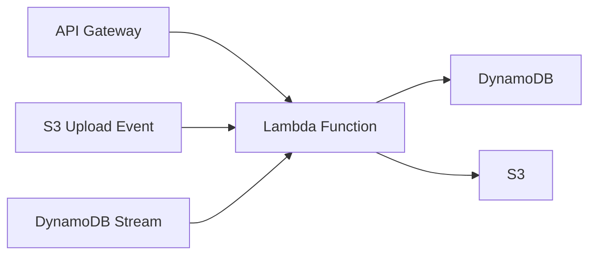

# ☁️ Cloud Computing & AWS Fundamentals

A complete guide to cloud computing concepts and core AWS services — compute, storage, networking, databases, and serverless.

---

## 📑 Table of Contents

- [Introduction to Cloud Computing & Service/Deployment Models](#introduction-to-cloud-computing--servicedeployment-models)
- [Amazon EC2 – Instances, AMIs, Security Groups & Key Pairs](#amazon-ec2--instances-amis-security-groups--key-pairs)
- [Amazon ECS – Containers Basics](#amazon-ecs--containers-basics)
- [Amazon S3 – Buckets, Objects & Storage Classes](#amazon-s3--buckets-objects--storage-classes)
- [Amazon EBS – Block Storage for EC2](#amazon-ebs--block-storage-for-ec2)
- [Amazon VPC – Subnets, Route Tables, Security Groups & VPC Peering](#amazon-vpc--subnets-route-tables-security-groups--vpc-peering)
- [Elastic Load Balancer – ALB & NLB](#elastic-load-balancer--alb--nlb)
- [Amazon RDS – Managed Relational Databases & Multi-AZ](#amazon-rds--managed-relational-databases--multi-az)
- [Amazon DynamoDB – NoSQL Basics & Creating Tables](#amazon-dynamodb--nosql-basics--creating-tables)
- [AWS Lambda – Serverless Functions & Integration](#aws-lambda--serverless-functions--integration)
- [AWS API Gateway – Creating and Managing APIs](#aws-api-gateway--creating-and-managing-apis)
- [References](#references)

---

## Introduction to Cloud Computing & Service/Deployment Models

### Traditional IT Deployment vs Cloud Computing

In traditional IT, organizations purchase, host, and maintain their own physical servers, networking equipment, and data centers — requiring large upfront capital investment, long procurement cycles, and dedicated staff for maintenance. Cloud computing replaces this with on-demand access to computing resources (servers, storage, databases, networking) delivered over the internet, billed on a pay-as-you-go basis.

| Aspect | Traditional IT | Cloud Computing |
|---|---|---|
| Cost Model | High upfront capital expense | Pay-as-you-go operational expense |
| Scalability | Manual, slow (buy more hardware) | Elastic, near-instant scaling |
| Maintenance | In-house hardware/software upkeep | Managed by the cloud provider |
| Provisioning Time | Weeks to months | Minutes |
| Global Reach | Limited by physical locations | Available across global regions instantly |

### Virtualization Concepts

Virtualization is the foundational technology that makes cloud computing possible. A **hypervisor** allows a single physical machine to run multiple isolated **virtual machines (VMs)**, each with its own OS and resources, sharing the underlying physical hardware. This enables cloud providers to efficiently pool and allocate compute resources across many customers.

### Service-Oriented Architecture (SOA)

SOA is a design approach where software is built as a collection of independent, loosely coupled **services** that communicate over a network (often via well-defined APIs). Each service performs a specific business function and can be reused across different applications — a concept that laid groundwork for modern cloud-native and microservices architectures.

### Cloud vs On-Premises – Pros and Cons

**Cloud Pros:** lower upfront cost, elastic scalability, global availability, reduced maintenance burden, faster time-to-market
**Cloud Cons:** ongoing operational cost can add up, less direct control over infrastructure, potential vendor lock-in, data governance/compliance considerations

**On-Premises Pros:** full control over hardware and data, no dependency on internet connectivity, predictable long-term costs at scale
**On-Premises Cons:** high capital investment, slow to scale, requires dedicated IT staff, higher risk of underutilized or over-provisioned hardware

### Cloud Service Models: IaaS, PaaS, SaaS



| Model | What You Manage | Provider Manages | Examples |
|---|---|---|---|
| **IaaS** (Infrastructure as a Service) | OS, runtime, applications, data | Servers, storage, networking, virtualization | Amazon EC2, Azure VMs, Google Compute Engine |
| **PaaS** (Platform as a Service) | Applications and data | OS, runtime, servers, infrastructure | AWS Elastic Beanstalk, Heroku, Google App Engine |
| **SaaS** (Software as a Service) | Just your data/usage | Everything — the entire application stack | Gmail, Salesforce, Dropbox, Microsoft 365 |

### Cloud Deployment Models: Public, Private, Hybrid, Community Cloud

| Model | Description |
|---|---|
| **Public Cloud** | Resources owned and operated by a third-party provider, shared across multiple customers (e.g., AWS, Azure, GCP) |
| **Private Cloud** | Infrastructure dedicated exclusively to a single organization, either on-premises or hosted |
| **Hybrid Cloud** | Combination of public and private clouds, allowing data/applications to move between them |
| **Community Cloud** | Shared infrastructure for a specific community of organizations with common concerns (e.g., compliance, security requirements) |

### Cloud Service Providers Overview: AWS, Azure, GCP

| Provider | Parent Company | Notable Strengths |
|---|---|---|
| **AWS** (Amazon Web Services) | Amazon | Largest market share, broadest service catalog, mature ecosystem |
| **Azure** | Microsoft | Deep integration with Microsoft enterprise tools (Active Directory, Office 365) |
| **GCP** (Google Cloud Platform) | Google | Strong in data analytics, machine learning, and Kubernetes (origin of K8s) |

---

## Amazon EC2 – Instances, AMIs, Security Groups & Key Pairs

### What is EC2? Virtual Servers in the Cloud

Amazon Elastic Compute Cloud (EC2) provides resizable virtual servers ("instances") in the cloud. It lets you provision compute capacity on demand without owning physical hardware, and scale up or down within minutes.

### Launching an EC2 Instance (Console Walkthrough)

1. Open the EC2 console and click **Launch Instance**
2. Choose an **Amazon Machine Image (AMI)** — the OS/software template
3. Choose an **instance type** (e.g., `t2.micro` for free tier)
4. Configure a **key pair** for SSH access
5. Configure **security group** rules (firewall)
6. Add storage (EBS volume) and launch

### Amazon Machine Images (AMIs)

An AMI is a pre-configured template containing the OS, application server, and any additional software needed to launch an instance. You can use AWS-provided AMIs, community AMIs, or create your own custom AMI from an existing configured instance for repeatable deployments.

### EC2 Instance Types

Instance types define the compute, memory, and networking capacity available. The `t2.micro` type is commonly used for learning and light workloads and is included in the **AWS Free Tier**. Other families include `m5` (general purpose), `c5` (compute optimized), and `r5` (memory optimized).

### Security Groups – Virtual Firewall

A security group acts as a virtual firewall controlling inbound and outbound traffic to an instance. Rules are defined by protocol, port range, and source/destination — for example, allowing inbound SSH (port 22) only from your IP address, and inbound HTTP (port 80) from anywhere.

### Key Pairs – Creating a `.pem` File, Connecting via SSH

AWS uses public-key cryptography to secure login access. When you create a key pair, AWS stores the public key and gives you the private key (`.pem` file) to download once — keep this file secure, as it cannot be re-downloaded.

```bash
chmod 400 my-key.pem
ssh -i my-key.pem ec2-user@<instance-public-ip>
```

---

## Amazon ECS – Containers Basics

### Docker and Container Basics

A container packages an application together with all its dependencies into a single, portable unit that runs consistently across environments — see the [Docker Guide](./DOCKER.md) for full details on containers and Docker.

### What is Amazon ECS?

Amazon Elastic Container Service (ECS) is a fully managed container orchestration service that lets you run, stop, and manage Docker containers on a cluster, without having to install or operate your own container orchestration software.

### Difference between ECS and EC2

| Aspect | EC2 | ECS |
|---|---|---|
| Abstraction Level | Virtual machine | Container orchestration on top of compute (EC2 or Fargate) |
| What You Manage | Full OS and runtime environment | Container definitions and task/service configuration |
| Use Case | General-purpose virtual servers | Running and scaling containerized applications |

### Creating and Managing Containers in ECS

ECS uses **Task Definitions** (blueprints describing container images, CPU/memory, ports, and environment variables) and **Services** (which maintain a desired number of running tasks). Containers can run on EC2 instances you manage, or on **AWS Fargate**, a serverless compute engine that removes the need to provision or manage servers at all.

---

## Amazon S3 – Buckets, Objects & Storage Classes

### What is S3? Buckets and Objects Concept

Amazon Simple Storage Service (S3) is object storage built for storing and retrieving any amount of data. A **bucket** is a container for objects, and an **object** is a file plus its metadata, identified by a unique key within the bucket.

### Creating an S3 Bucket (Console Walkthrough)

1. Open the S3 console and click **Create bucket**
2. Choose a globally unique bucket name and AWS Region
3. Configure public access settings (blocked by default)
4. Enable versioning if needed, then create the bucket

### Uploading and Downloading Objects

Objects can be uploaded/downloaded via the console, AWS CLI, or SDKs:
```bash
aws s3 cp myfile.txt s3://my-bucket-name/
aws s3 cp s3://my-bucket-name/myfile.txt ./
```

### Bucket Access Permissions (Public vs Private)

By default, S3 buckets and objects are **private**. Access can be controlled via **Bucket Policies** (JSON-based resource policies), **IAM Policies** (user/role-based), and **Access Control Lists (ACLs)**. Public access should only be enabled deliberately and cautiously.

### S3 Storage Classes

| Storage Class | Best For | Retrieval Time |
|---|---|---|
| **Standard** | Frequently accessed data | Immediate |
| **Intelligent-Tiering** | Data with unpredictable access patterns | Immediate |
| **Standard-IA** (Infrequent Access) | Rarely accessed but needs fast access when needed | Immediate |
| **Glacier** | Long-term archival, rarely accessed | Minutes to hours |

### Lifecycle Policies and Versioning

**Lifecycle policies** automatically transition objects between storage classes or expire them after a defined period — e.g., moving logs to Glacier after 90 days. **Versioning** keeps multiple variants of an object in the same bucket, protecting against accidental overwrites or deletions.

---

## Amazon EBS – Block Storage for EC2

### What is Amazon EBS (Elastic Block Store)?

EBS provides persistent block-level storage volumes for use with EC2 instances. Unlike the temporary instance store, EBS volumes persist independently of the instance lifecycle and can be detached/reattached.

### Creating and Attaching EBS Volumes to EC2 Instances

Volumes are created in a specific Availability Zone and can only be attached to instances within that same zone. They can be created during instance launch or attached afterward via the EC2 console or CLI.

### EBS Volume Types

| Type | Description | Use Case |
|---|---|---|
| **gp2/gp3** | General-purpose SSD | Most workloads, boot volumes |
| **io1/io2** | Provisioned IOPS SSD | High-performance databases requiring low latency |

### Snapshots and Backup

**Snapshots** are point-in-time, incremental backups of EBS volumes stored in S3. They can be used to create new volumes, migrate data across Availability Zones/Regions, or restore data after failure.

---

## Amazon VPC – Subnets, Route Tables, Security Groups & VPC Peering

### What is a VPC? Isolated Virtual Network in the Cloud

A Virtual Private Cloud (VPC) is a logically isolated section of AWS where you can launch resources within a virtual network that you define — including IP address ranges, subnets, route tables, and gateways.



### Public Subnet vs Private Subnet

A **public subnet** has a route to an Internet Gateway, making resources within it reachable from the internet (e.g., web servers). A **private subnet** has no direct internet route, keeping resources like databases isolated from public access.

### Route Tables – Directing Traffic Between Subnets

A route table contains rules ("routes") that determine where network traffic from a subnet is directed. Each subnet must be associated with a route table.

### Internet Gateway (IGW) and NAT Gateway

An **Internet Gateway** allows communication between resources in a VPC and the internet. A **NAT Gateway** allows instances in a private subnet to initiate outbound internet connections (e.g., for software updates) while preventing inbound connections from the internet.

### Security Groups (Instance-Level Firewall)

As covered under EC2, security groups control inbound/outbound traffic at the instance level and are commonly used within VPCs to control access between subnets and external traffic.

### VPC Peering – Connecting Two VPCs

VPC Peering creates a direct networking connection between two VPCs, allowing resources in either VPC to communicate as if they were on the same network — without traffic passing over the public internet.

---

## Elastic Load Balancer – ALB & NLB

### What is Elastic Load Balancing?

Elastic Load Balancing (ELB) automatically distributes incoming application traffic across multiple targets (EC2 instances, containers, IP addresses) in one or more Availability Zones, improving fault tolerance and availability.

### Application Load Balancer (ALB) – Layer 7

Operates at the application layer (HTTP/HTTPS) and supports advanced routing based on URL path, hostname, or headers — ideal for microservices and container-based applications.

### Network Load Balancer (NLB) – Layer 4

Operates at the transport layer (TCP/UDP), designed for extreme performance and low latency, capable of handling millions of requests per second while preserving the client's source IP.

### ALB vs NLB – When to Use Which

| Aspect | ALB | NLB |
|---|---|---|
| OSI Layer | 7 (Application) | 4 (Transport) |
| Routing | Path/host/header-based | Connection-based |
| Best For | Web apps, microservices, containers | Ultra-high performance, static IP needs, TCP/UDP traffic |

### Target Groups and Health Checks

A **target group** routes requests to registered targets (e.g., EC2 instances). The load balancer performs periodic **health checks** on each target and only routes traffic to targets that are reporting healthy.

---

## Amazon RDS – Managed Relational Databases & Multi-AZ

### What is Amazon RDS?

Amazon Relational Database Service (RDS) is a managed service that simplifies setting up, operating, and scaling relational databases — handling routine tasks like provisioning, patching, backup, and recovery.

### Managed vs Self-Managed Databases

With a self-managed database (e.g., installed manually on EC2), you're responsible for OS patching, database software updates, backups, and failover. RDS automates all of this, letting teams focus on the application rather than database administration.

### Creating an RDS Database Instance (Console Walkthrough)

1. Open the RDS console and click **Create database**
2. Choose a database engine (MySQL, PostgreSQL, etc.)
3. Select an instance size and storage configuration
4. Configure VPC/subnet placement (typically a private subnet)
5. Set credentials and launch

### Supported DB Engines

MySQL, PostgreSQL, MariaDB, Oracle, SQL Server, and **Amazon Aurora** (AWS's high-performance, MySQL/PostgreSQL-compatible engine).

### Multi-AZ Deployments for High Availability

Multi-AZ deployments automatically provision and maintain a synchronous standby replica in a different Availability Zone. If the primary database fails, RDS automatically fails over to the standby with minimal downtime.

### RDS Automated Backups and Snapshots

RDS performs automated daily backups and transaction log backups within a defined retention window, enabling point-in-time recovery. Manual snapshots can also be taken and retained indefinitely.

---

## Amazon DynamoDB – NoSQL Basics & Creating Tables

### What is DynamoDB? NoSQL Key-Value and Document DB Concept

DynamoDB is a fully managed NoSQL database service supporting key-value and document data models, built for consistent, single-digit-millisecond performance at any scale.

### RDS (Relational/SQL) vs DynamoDB (NoSQL)

| Aspect | RDS (SQL) | DynamoDB (NoSQL) |
|---|---|---|
| Data Model | Structured tables with fixed schema | Flexible schema, key-value/document |
| Query Language | SQL | API-based queries |
| Scaling | Vertical (mostly) | Horizontal, virtually unlimited |
| Best For | Complex relationships, transactions | High-scale, low-latency, simple access patterns |

### Creating a DynamoDB Table (Console Walkthrough)

1. Open the DynamoDB console and click **Create table**
2. Define the table name and primary key
3. Configure capacity mode (on-demand or provisioned)
4. Create the table

### Primary Keys: Partition Key and Sort Key

Every DynamoDB table requires a **partition key** (determines data distribution) and optionally a **sort key** (enables sorting/range queries within a partition), together forming a composite primary key.

### Basic Querying and Scanning

**Query** operations retrieve items efficiently using the primary key. **Scan** operations examine every item in the table — useful for ad hoc access but far less efficient at scale.

### DynamoDB for High-Scale, Low-Latency Use Cases

DynamoDB is commonly used for use cases like gaming leaderboards, shopping carts, session stores, and IoT data ingestion, where predictable, fast performance at massive scale matters more than complex relational queries.

---

## AWS Lambda – Serverless Functions & Integration

### What is Serverless Computing?

Serverless computing lets you run code without provisioning or managing servers. The cloud provider automatically handles scaling, patching, and availability — you only pay for the compute time you actually consume.

### AWS Lambda – Event-Driven Execution Model

AWS Lambda runs your code in response to **events**, automatically managing the compute resources required. Functions run only when triggered and scale automatically with the number of incoming events.

### Event Sources / Triggers

Common Lambda triggers include:
- **S3** – e.g., run a function when a file is uploaded
- **API Gateway** – e.g., handle an HTTP API request
- **DynamoDB Streams** – e.g., react to changes in table data

### Creating and Deploying a Lambda Function (Console Walkthrough)

1. Open the Lambda console and click **Create function**
2. Choose a runtime (e.g., Python, Node.js, Java)
3. Write or upload your function code
4. Configure a trigger (e.g., API Gateway)
5. Deploy and test

### Lambda Runtime

Lambda natively supports multiple runtimes including **Java**, **Node.js**, and **Python**, as well as custom runtimes via container images.

### Pay-Per-Execution Pricing Model

You're billed based on the number of requests and the duration/memory used per execution — there's no charge when your code isn't running, making it highly cost-efficient for intermittent workloads.

### Integrating Lambda with Other AWS Services

Lambda is commonly used as the compute "glue" of serverless architectures — processing S3 uploads, responding to API Gateway requests, reacting to DynamoDB changes, or running scheduled tasks via EventBridge.



---

## AWS API Gateway – Creating and Managing APIs

### What is AWS API Gateway?

API Gateway is a fully managed service for creating, publishing, securing, and monitoring APIs at scale, acting as the "front door" for applications to access backend services like Lambda functions or other AWS services.

### Creating a REST API (Console Walkthrough)

1. Open the API Gateway console and click **Create API**
2. Choose REST API (or HTTP API)
3. Define resources (paths) and methods
4. Configure integrations (e.g., Lambda)
5. Deploy the API to a stage

### Defining HTTP Methods and Routes

Routes are defined as a combination of a resource path (e.g., `/users`) and an HTTP method (`GET`, `POST`, `PUT`, `DELETE`), each mapped to a specific backend integration.

### Integrating API Gateway with Lambda (Serverless Backend)

API Gateway can directly invoke a Lambda function for a given route, enabling a fully serverless API where API Gateway handles routing/auth and Lambda handles business logic — with no servers to manage.

### Deployment Stages

Stages (e.g., `dev`, `staging`, `prod`) represent different named references to a deployed snapshot of the API, allowing you to test changes safely before promoting them to production.

### Throttling and Basic API Security

API Gateway supports **throttling** (rate-limiting requests to protect backend services from being overwhelmed) and security mechanisms including **API keys**, **IAM authorization**, and **Lambda authorizers/Cognito** for custom authentication.

---

## 📚 References

- [freeCodeCamp – Beginner's Guide to Cloud Computing with AWS](https://www.freecodecamp.org/news/beginners-guide-to-cloud-computing-with-aws/)
- [GeeksforGeeks – AWS Tutorial](https://www.geeksforgeeks.org/devops/aws-tutorial/)
- [AWS for Engineers – AWS Tutorial for Beginners](https://awsforengineers.com/blog/aws-tutorial-for-beginners-step-by-step-core-concepts/)
- [GeeksforGeeks – Amazon EC2: Creating an Elastic Cloud Compute Instance](https://www.geeksforgeeks.org/devops/amazon-ec2-creating-an-elastic-cloud-compute-instance/)
- [GeeksforGeeks – What is Amazon Machine Image (AMI)?](https://www.geeksforgeeks.org/cloud-computing/what-is-amazon-machine-image-ami/)
- [GeeksforGeeks – Securing EC2 Instances with Security Groups and Key Pairs](https://www.geeksforgeeks.org/devops/securing-ec2-instances-with-security-groups-and-key-pairs/)
- [GeeksforGeeks – 30 Days of AWS](https://www.geeksforgeeks.org/devops/30-days-of-aws/)
- [GeeksforGeeks – Top AWS Services](https://www.geeksforgeeks.org/cloud-computing/top-aws-services/)
- [GeeksforGeeks – Amazon S3: Creating a Bucket](https://www.geeksforgeeks.org/cloud-computing/amazon-s3-creating-a-s3-bucket/)
- [GeeksforGeeks – Introduction to AWS S3](https://www.geeksforgeeks.org/devops/introduction-to-aws-simple-storage-service-aws-s3/)
- [GeeksforGeeks – Amazon S3 Storage Classes](https://www.geeksforgeeks.org/devops/amazon-s3-storage-classes/)
- [GeeksforGeeks – How to Store Data in an S3 Bucket](https://www.geeksforgeeks.org/devops/how-to-store-data-in-a-s3-bucket/)
- [GeeksforGeeks – Amazon VPC: Introduction](https://www.geeksforgeeks.org/devops/amazon-vpc-introduction-to-amazon-virtual-cloud/)
- [GeeksforGeeks – Amazon VPC Networking Components](https://www.geeksforgeeks.org/devops/amazon-vpc-networking-components/)
- [GeeksforGeeks – Working with VPCs and Subnets](https://www.geeksforgeeks.org/devops/amazon-vpc-working-with-vpcs-and-subnets/)
- [GeeksforGeeks – AWS VPC Route Table](https://www.geeksforgeeks.org/cloud-computing/aws-vpc-route-table/)
- [GeeksforGeeks – Configuring RDS Instances in a Private Subnet](https://www.geeksforgeeks.org/devops/configuring-rds-instances-in-a-private-subnet/)
- [GeeksforGeeks – AWS Interview Questions](https://www.geeksforgeeks.org/cloud-computing/aws-interview-questions/)
- [GeeksforGeeks – Introduction to AWS Lambda](https://www.geeksforgeeks.org/devops/introduction-to-aws-lambda/)

---

