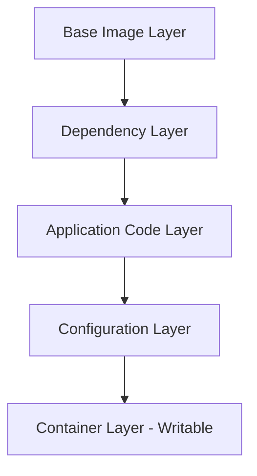
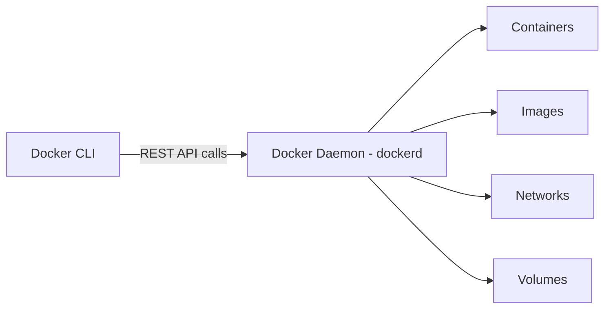
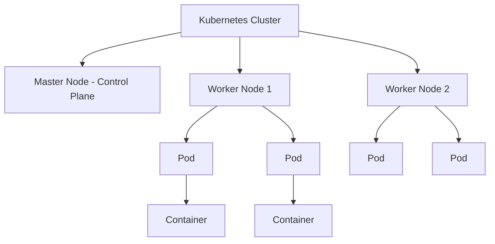

# 🐳 Docker Guide

A complete guide to Docker — commands, images, Compose, networking, storage, and container orchestration.

---

## 📑 Table of Contents

- [Docker Commands](#docker-commands)
- [Docker Run](#docker-run)
- [Docker Images](#docker-images)
- [Docker Compose](#docker-compose)
- [Docker Engine](#docker-engine)
- [Docker Storage](#docker-storage)
- [Docker Networking](#docker-networking)
- [Container Orchestration](#container-orchestration)
- [References](#references)

---

## Docker Commands

### Basic Docker Commands

| Command | Description |
|---|---|
| `docker run` | Creates and starts a new container from an image |
| `docker ps` | Lists all running containers (`docker ps -a` shows all, including stopped) |
| `docker stop <container>` | Gracefully stops a running container |
| `docker rm <container>` | Removes a stopped container |
| `docker images` | Lists all locally available images |
| `docker rmi <image>` | Removes a local image |
| `docker pull <image>` | Downloads an image from a registry (e.g., Docker Hub) |
| `docker exec` | Runs a command inside an already running container |

**Appending a command:**
You can append a command to `docker run` to override the container's default startup command:
```bash
docker run ubuntu echo "Hello from container"
```

**Using exec:**
`exec` lets you run additional commands inside a container that is already running — commonly used to open an interactive shell:
```bash
docker exec -it <container_id> /bin/bash
```

---

## Docker Run

### How to Use the `docker run` Command

The `docker run` command creates a new container from a specified image and starts it:
```bash
docker run <image_name>
```

### Run a Container Under a Specific Name
```bash
docker run --name my_container nginx
```

### Run a Container in the Background (Detached Mode)
```bash
docker run -d nginx
```
The `-d` flag runs the container in the background and prints the container ID.

### Run a Container Interactively
```bash
docker run -it ubuntu /bin/bash
```
The `-it` flags combine an interactive terminal (`-i`) with a pseudo-TTY (`-t`), letting you interact with the container's shell directly.

### Run a Container and Publish Container Ports
```bash
docker run -p 8080:80 nginx
```
This maps port `8080` on the host to port `80` inside the container (`-p host_port:container_port`).

### Run a Docker Container and Remove it Once the Process is Complete
```bash
docker run --rm ubuntu echo "This container will self-destruct"
```
The `--rm` flag automatically removes the container once it exits, keeping your system clean of stopped containers.

---

## Docker Images

### What is a Docker Image?

A Docker image is a lightweight, standalone, read-only template that contains everything needed to run an application — code, runtime, libraries, environment variables, and configuration files. Containers are simply running instances of images.

### Image Layers

Docker images are built in **layers**, where each layer represents an instruction in the Dockerfile (e.g., installing a package, copying files). Layers are cached and reused, which makes builds faster and images more storage-efficient.



### Container Layer

When a container is created from an image, Docker adds a thin **writable layer** on top of the read-only image layers. All changes made while the container runs — new files, modified data — are written to this container layer, while the underlying image layers remain untouched.

### Parent Image

The image that your image is built **from** — typically referenced in the `FROM` instruction of a Dockerfile. It provides the foundational layers on which your custom layers are added.

### Base Image

An image with **no parent** (built from scratch), typically a minimal OS layer such as `alpine` or `scratch`. It serves as the starting point for building other images.

### Docker Manifest

A JSON file that describes an image — its layers, configuration, platform compatibility (OS/architecture), and digest. It allows Docker to support multi-platform images.

### Container Registries

A registry is a centralized service for storing and distributing Docker images (e.g., Docker Hub, Amazon ECR, Google Container Registry, GitHub Container Registry).

### Container Repositories

A repository is a collection of related images within a registry, typically different versions/tags of the same application (e.g., `nginx:latest`, `nginx:1.25`).

### How to Create a Docker Image

**1. Interactive Method**
Start a container, make changes inside it manually, then commit those changes as a new image:
```bash
docker run -it ubuntu /bin/bash
# make changes inside the container
docker commit <container_id> my_custom_image
```

**2. Dockerfile Method (Recommended)**
Define the image build steps in a `Dockerfile`, then build it:
```dockerfile
FROM node:18
WORKDIR /app
COPY package.json .
RUN npm install
COPY . .
CMD ["npm", "start"]
```
```bash
docker build -t my_app .
```

### The Docker Build Context

The **build context** is the set of files and directories sent to the Docker daemon when running `docker build`. It's typically the directory containing the Dockerfile (`.` in the command above). Everything inside the context is available to `COPY`/`ADD` instructions — use a `.dockerignore` file to exclude unnecessary files and keep builds fast.

---

## Docker Compose

### What is Docker Compose?

Docker Compose is a tool for defining and running **multi-container** Docker applications using a single YAML configuration file. Instead of starting each container manually, Compose lets you spin up an entire application stack with one command.

### Benefits of Docker Compose

- 📝 Define your entire stack (services, networks, volumes) in one file
- ⚡ Start/stop the whole application with a single command
- 🔁 Reproducible environments across dev, test, and production
- 🔗 Automatic networking between services
- 📦 Easy scaling of individual services

### Basic Commands in Docker Compose

| Command | Description |
|---|---|
| `docker compose up` | Builds and starts all services |
| `docker compose up -d` | Starts services in detached mode |
| `docker compose down` | Stops and removes containers, networks |
| `docker compose ps` | Lists running Compose services |
| `docker compose logs` | Displays log output from services |
| `docker compose build` | Builds/rebuilds service images |
| `docker compose stop` | Stops running services without removing them |

### Install Docker Compose

Docker Compose now ships as a plugin with Docker Desktop and Docker Engine (`docker compose`, no hyphen). For Linux systems without Docker Desktop:
```bash
sudo apt-get update
sudo apt-get install docker-compose-plugin
```

### Create the Compose File

Create a file named `docker-compose.yml` in your project's root directory.

### The YAML Configuration File

```yaml
version: "3.9"
services:
  web:
    build: .
    ports:
      - "5000:5000"
    depends_on:
      - db
  db:
    image: postgres:15
    environment:
      POSTGRES_PASSWORD: example
    volumes:
      - db_data:/var/lib/postgresql/data

volumes:
  db_data:
```

---

## Docker Engine

### What is Docker Engine?

Docker Engine is the core underlying technology that builds and runs containers. It has three main components:



- **Docker CLI** – the command-line interface (`docker` command) that users interact with to issue commands
- **REST API** – the interface used by the CLI (and other tools) to communicate with the Docker daemon
- **Docker Daemon (dockerd)** – the background service that does the actual work: building images, running containers, and managing networks/volumes

---

## Docker Storage

### Storage Drivers

Storage drivers manage how image layers and container layers are stored and accessed on the host filesystem (e.g., `overlay2`, `aufs`, `btrfs`). `overlay2` is the recommended default on most modern Linux distributions.

### Data Volumes

Volumes are the preferred mechanism for persisting data generated and used by Docker containers. Unlike the container's writable layer, volumes exist independently of the container's lifecycle, so data survives even if the container is deleted.

### Changing the Storage Driver for a Container

The storage driver is configured at the Docker daemon level, typically via the daemon configuration file (`/etc/docker/daemon.json`):
```json
{
  "storage-driver": "overlay2"
}
```
After editing, restart the Docker daemon for changes to take effect.

### Creating a Volume
```bash
docker volume create my_volume
```

### Listing all the Volumes
```bash
docker volume ls
```

---

## Docker Networking

### Default Networks

Docker automatically creates three default networks:
| Network | Description |
|---|---|
| `bridge` | Default network for containers on a single host |
| `host` | Removes network isolation between container and host |
| `none` | Disables networking entirely for the container |

### Listing All Docker Networks
```bash
docker network ls
```

### Inspecting a Docker Network
```bash
docker network inspect <network_name>
```
This shows detailed configuration — connected containers, subnet, gateway, and driver.

### Creating Your Own New Network
```bash
docker network create my_custom_network
```
You can then run containers on this custom network so they can communicate with each other by container name:
```bash
docker run -d --network my_custom_network --name app1 my_image
```

---

## Container Orchestration

### What is Container Orchestration?

Container orchestration is the automated management of containerized applications — including deployment, scaling, networking, and availability — across a cluster of machines.

### Why do we need Container Orchestration?

As applications grow into dozens or hundreds of containers spread across multiple hosts, manually managing them becomes impractical. Orchestration tools automate scheduling, scaling, health checks, and recovery.

### Benefits of Container Orchestration

- 📈 **Auto-scaling** – automatically scale containers up/down based on load
- 🔄 **Self-healing** – automatically restart failed containers
- ⚖️ **Load balancing** – distribute traffic evenly across containers
- 🚀 **Rolling updates & rollbacks** – deploy new versions with zero downtime
- 🗺️ **Service discovery** – containers can find and communicate with each other automatically
- 🖥️ **Multi-host management** – manage containers across a cluster of machines as a single system

### What is Kubernetes Container Orchestration?

Kubernetes (K8s) is the most widely adopted container orchestration platform. It automates the deployment, scaling, and management of containerized applications across a cluster of nodes, using concepts like Pods, Deployments, Services, and Namespaces.



### Container Orchestration vs Docker

| Aspect | Docker | Container Orchestration (e.g., Kubernetes) |
|---|---|---|
| Scope | Building & running individual containers | Managing clusters of containers across multiple hosts |
| Scaling | Manual | Automated |
| Networking | Single-host focused (with Compose for multi-container) | Cross-host service discovery & load balancing |
| Self-healing | Not built-in | Automatic container restarts/rescheduling |
| Use Case | Local development, single-host apps | Production-grade, distributed systems at scale |

---

## 📚 References

- [GeeksforGeeks – Docker Tutorial](https://www.geeksforgeeks.org/docker-tutorial/)

---

