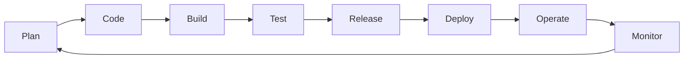
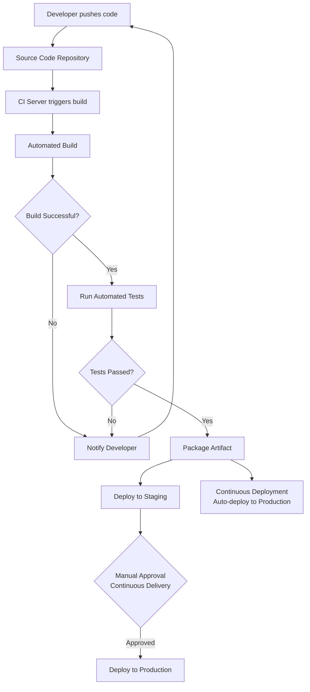

# 🚀 DevOps & CI/CD Guide

A comprehensive guide covering DevOps fundamentals, CI/CD concepts, and popular tools used in modern software delivery pipelines.

---

## 📑 Table of Contents

- [Introduction to DevOps](#introduction-to-devops)
  - [What is DevOps?](#what-is-devops)
  - [Goals and Benefits of DevOps](#goals-and-benefits-of-devops)
  - [Key DevOps Practices](#key-devops-practices)
- [Understanding CI/CD](#understanding-cicd)
  - [What is Continuous Integration (CI)?](#what-is-continuous-integration-ci)
  - [What is Continuous Deployment/Delivery (CD)?](#what-is-continuous-deploymentdelivery-cd)
  - [Differences between CI and CD](#differences-between-ci-and-cd)
  - [Benefits of CI/CD](#benefits-of-cicd)
- [CI/CD Tools and Platforms](#cicd-tools-and-platforms)
- [References](#references)

---

## Introduction to DevOps

### What is DevOps?

DevOps is a cultural and technical movement that brings together **Development (Dev)** and **Operations (Ops)** teams, which traditionally worked in isolated silos. Instead of developers writing code and then "throwing it over the wall" to operations for deployment and maintenance, DevOps encourages both teams to collaborate throughout the entire software lifecycle — from planning and coding to testing, deployment, and monitoring.

At its core, DevOps is about breaking down organizational barriers, automating repetitive processes, and fostering a culture of shared responsibility so that software can be built, tested, and released faster and more reliably.

### Goals and Benefits of DevOps

**Goals:**
- Shorten the software development lifecycle (SDLC)
- Enable faster, more frequent, and more reliable releases
- Improve collaboration between development, QA, and operations teams
- Increase automation across the pipeline
- Continuously monitor and improve system performance

**Benefits:**
| Benefit | Description |
|---|---|
| ⚡ Faster Delivery | Automation and streamlined workflows reduce time-to-market |
| 🤝 Better Collaboration | Shared ownership breaks down silos between teams |
| 🔄 Improved Reliability | Continuous testing and monitoring catch issues early |
| 📈 Scalability | Infrastructure as Code makes scaling predictable and repeatable |
| 🛡️ Increased Stability | Smaller, incremental changes reduce the risk of major failures |
| 💰 Cost Efficiency | Automation reduces manual effort and operational overhead |

### Key DevOps Practices

- **Continuous Integration (CI)** – frequently merging code changes into a shared repository
- **Continuous Delivery/Deployment (CD)** – automating the release process
- **Infrastructure as Code (IaC)** – managing infrastructure through code (e.g., Terraform, Ansible)
- **Configuration Management** – maintaining consistent system configurations
- **Continuous Monitoring** – tracking application and infrastructure health in real time
- **Version Control** – using tools like Git to track and manage code changes
- **Automated Testing** – catching bugs early through unit, integration, and regression tests
- **Containerization & Orchestration** – using Docker and Kubernetes for consistent environments

### DevOps Lifecycle Flow

---

## Understanding CI/CD

### What is Continuous Integration (CI)?

Continuous Integration is the practice of developers frequently merging their code changes into a central repository, after which automated builds and tests are triggered. The goal is to detect integration issues, bugs, and conflicts as early as possible, rather than waiting until later stages of development.

**Typical CI workflow:**
1. Developer commits code to a shared repository
2. Automated build is triggered
3. Automated tests run against the new code
4. Feedback is provided immediately if something breaks

### What is Continuous Deployment/Delivery (CD)?

**Continuous Delivery** ensures that code is always in a deployable state after passing through the CI pipeline and automated testing. Releases to production still require a manual approval step.

**Continuous Deployment** goes a step further — every change that passes automated tests is automatically deployed to production **without human intervention**.

### Differences between CI and CD

| Aspect | Continuous Integration (CI) | Continuous Delivery | Continuous Deployment |
|---|---|---|---|
| Focus | Merging and testing code | Preparing releases | Automatically releasing code |
| Automation Level | Build + Test | Build + Test + Staging | Build + Test + Production Release |
| Human Intervention | N/A | Manual approval before production | None — fully automated |
| Goal | Catch bugs early | Keep code release-ready | Ship to users continuously |

### Benefits of CI/CD

- ✅ Early detection of bugs and integration issues
- 🚀 Faster and more frequent releases
- 🔁 Reduced manual effort through automation
- 📉 Lower risk with smaller, incremental changes
- 🧪 Improved code quality via consistent automated testing
- 👀 Greater visibility into the development and release process
- 😌 Increased developer confidence and productivity

### CI/CD Pipeline Flow

---

## CI/CD Tools and Platforms

Here's an overview of some of the most popular CI/CD tools used in the industry today:

### 🔧 Jenkins
An open-source automation server widely used for building CI/CD pipelines. Highly extensible through hundreds of plugins, self-hosted, and supports almost any language or platform.

### ⚙️ GitHub Actions
A CI/CD platform built directly into GitHub. Enables developers to automate workflows (build, test, deploy) using YAML configuration files stored alongside the code, with tight integration into the GitHub ecosystem.

### 🦊 GitLab CI/CD
A built-in CI/CD solution within GitLab, configured via a `.gitlab-ci.yml` file. Offers a complete DevOps platform including source control, CI/CD, and monitoring in one place.

### ⭕ CircleCI
A cloud-based (and self-hosted) CI/CD platform known for speed and simplicity, with strong support for Docker and parallel job execution.

### Other Notable Tools
- **Travis CI** – simple, cloud-based CI/CD, popular with open-source projects
- **Azure DevOps** – Microsoft's suite for CI/CD, boards, and repos
- **Bamboo** – Atlassian's CI/CD server, integrates well with Jira and Bitbucket
- **ArgoCD** – GitOps-based continuous delivery for Kubernetes
- **TeamCity** – JetBrains' CI/CD server with strong IDE integration

| Tool | Hosting | Best For |
|---|---|---|
| Jenkins | Self-hosted | Full customization & plugin ecosystem |
| GitHub Actions | Cloud (GitHub-native) | Projects already hosted on GitHub |
| GitLab CI/CD | Cloud / Self-hosted | All-in-one DevOps platform |
| CircleCI | Cloud / Self-hosted | Speed and Docker-first pipelines |

---

## 📚 References

- [GeeksforGeeks – DevOps Tutorial](https://www.geeksforgeeks.org/devops-tutorial/)
- [GeeksforGeeks – Introduction to DevOps](https://www.geeksforgeeks.org/introduction-to-devops/)
- [GeeksforGeeks – What is CI/CD?](https://www.geeksforgeeks.org/what-is-cicd/)

---

