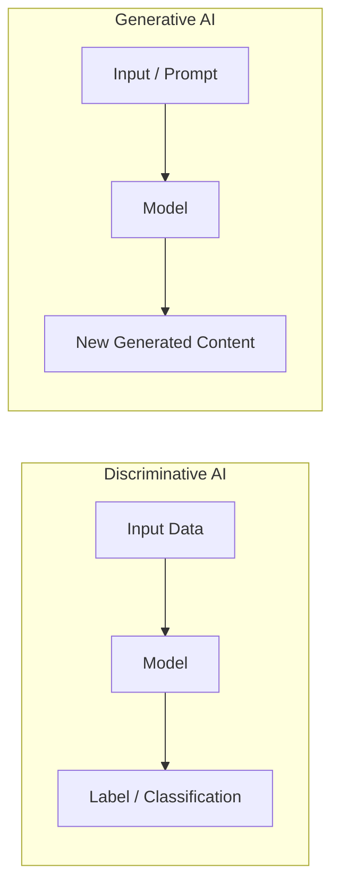
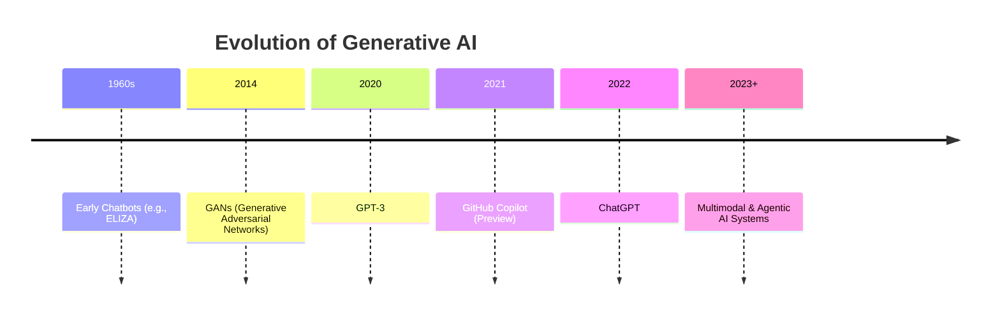
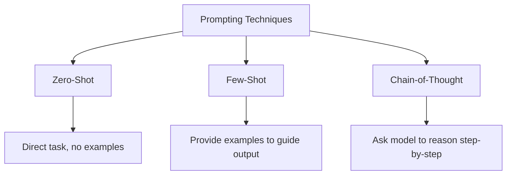

# 🤖 Generative AI & GitHub Copilot Guide

A complete guide to Generative AI fundamentals, prompt engineering, and using GitHub Copilot as an AI pair programmer.

---

## 📑 Table of Contents

- [Introduction to Generative AI](#introduction-to-generative-ai)
- [Prompt Engineering – Techniques, Best Practices & Ethics](#prompt-engineering--techniques-best-practices--ethics)
- [Introduction to GitHub Copilot](#introduction-to-github-copilot)
- [Setup and Configuration](#setup-and-configuration)
- [Core Features and Capabilities](#core-features-and-capabilities)
- [Security and Ethical Considerations](#security-and-ethical-considerations)
- [References](#references)

---

## Introduction to Generative AI

### What is Generative AI?

Generative AI (GenAI) refers to a class of artificial intelligence models that can create new, original content — text, code, images, audio, or video — by learning patterns from large amounts of training data. Rather than simply classifying or predicting a label for existing input, generative models produce novel output that resembles what they were trained on.

### How GenAI Differs from Traditional (Discriminative) AI



| Aspect | Discriminative AI | Generative AI |
|---|---|---|
| Goal | Classify or predict a label | Create new content |
| Example Task | "Is this email spam?" | "Write an email for me" |
| Output | A category or numeric prediction | Text, images, code, audio, etc. |
| Learns | Decision boundaries between classes | The underlying data distribution itself |
| Examples | Spam filters, fraud detection, image classifiers | ChatGPT, DALL·E, GitHub Copilot |

### Overview of GenAI Applications

- **Text Generation** – drafting articles, emails, summaries, and creative writing
- **Code Completion** – suggesting and writing code (e.g., GitHub Copilot)
- **Image Creation** – generating images from text descriptions (e.g., DALL·E, Midjourney)
- **Chatbots & Conversational Agents** – interactive assistants for support, research, and productivity (e.g., ChatGPT, Claude)

### History and Evolution of Generative AI



- **1960s – Early Chatbots**: Rule-based systems like ELIZA simulated conversation using scripted pattern matching, with no real language understanding.
- **2014 – GANs**: Generative Adversarial Networks introduced a new architecture where two neural networks (generator and discriminator) compete, enabling realistic image generation.
- **2020 – GPT-3**: OpenAI's large language model demonstrated that scaling transformer models could produce remarkably coherent, general-purpose text generation.
- **2022 – ChatGPT**: Brought conversational generative AI to mainstream/public use, popularizing chat-based interaction with LLMs.
- **GitHub Copilot and Beyond**: AI-powered coding assistants integrated directly into developer workflows, followed by increasingly capable multimodal and agentic AI systems.

---

## Prompt Engineering – Techniques, Best Practices & Ethics

### What is Prompt Engineering and Why It Matters for Developers

Prompt engineering is the practice of designing and refining inputs (prompts) to guide a generative AI model toward producing accurate, relevant, and useful output. For developers, well-crafted prompts can mean the difference between generic, unusable output and precise, production-ready code or content — making it a practical skill for working effectively with AI coding tools.

### Prompting Techniques



| Technique | Description | Example |
|---|---|---|
| **Zero-Shot Prompting** | Ask the model to perform a task directly, with no examples provided | "Summarize this article in 3 bullet points." |
| **Few-Shot Prompting** | Provide a few examples of the desired input/output pattern before the actual task | Show 2–3 sample Q&A pairs, then ask a new question in the same format |
| **Chain-of-Thought Prompting** | Explicitly ask the model to reason step-by-step before giving a final answer | "Think through this step by step before giving your final answer." |

### Best Practices

- ✅ **Be clear and specific** — vague prompts produce vague results
- 📋 **Provide context** — background info helps the model tailor its response
- 🎯 **Specify the output format** — e.g., "respond in a table," "return valid JSON"
- 🔁 **Iterate** — treat prompting as a conversation; refine based on the model's output
- 🧩 **Break complex tasks into smaller steps** rather than one giant prompt

### Ethical Considerations

- ⚖️ **Avoiding bias in prompts** — be mindful that prompts (and training data) can reinforce stereotypes or unfair assumptions
- ✅ **Accuracy** — always verify AI-generated output, especially factual claims ("hallucinations" are a known risk)
- 🔒 **Privacy** — avoid including sensitive personal or proprietary data in prompts sent to third-party AI services
- 🤝 **Responsible AI usage** — disclose AI involvement where appropriate, and use AI output as a starting point rather than a final, unreviewed answer

### Hands-On: Writing Coding-Task Prompts

**Weak prompt:**
```
Write some code for sorting.
```

**Strong prompt:**
```
Write a C# method named SortDescending that takes a List<int> as input
and returns a new List<int> sorted in descending order.
Include XML doc comments and a simple usage example.
```

---

## Introduction to GitHub Copilot

### What is GitHub Copilot?

GitHub Copilot is an AI-powered coding assistant that integrates directly into your code editor, offering real-time code suggestions, autocompletions, and entire function implementations based on natural language comments and existing code context.

### Overview of GitHub Copilot Features

- Inline code suggestions and multi-line completions
- Natural-language-to-code generation from comments
- Chat interface for asking coding questions in context (Copilot Chat)
- Test generation and code explanation
- Support for translating code between languages

### How Copilot Works (AI Pair Programmer)

Copilot analyzes the surrounding code context — open files, comments, function names, and cursor position — and sends this context to an underlying large language model, which returns relevant code suggestions in real time. It's designed to act like an "AI pair programmer" sitting alongside the developer.

### Supported IDEs and Languages

Copilot supports popular editors including **Visual Studio Code**, **Visual Studio**, **JetBrains IDEs** (IntelliJ, PyCharm, etc.), and **Neovim**. It works across most mainstream programming languages, with particularly strong performance on widely-used languages like Python, JavaScript/TypeScript, Java, C#, and Go.

---

## Setup and Configuration

### Installing GitHub Copilot Extension in VS Code

1. Open VS Code and go to the **Extensions** view (`Ctrl+Shift+X` / `Cmd+Shift+X`)
2. Search for **"GitHub Copilot"**
3. Click **Install**
4. Reload VS Code if prompted

### Connecting to a GitHub Account

1. After installing, click the Copilot icon in the status bar (or sidebar)
2. Select **Sign in to GitHub**
3. Authorize the extension in the browser window that opens
4. Confirm an active Copilot subscription/license is associated with your account

### Beginner-Friendly First Coding Task with Copilot

Try writing a comment describing a function and let Copilot suggest the implementation:
```python
# Function to check if a number is a palindrome
```
Press **Tab** to accept Copilot's suggested implementation, then review and test it.

---

## Core Features and Capabilities

### Code Suggestions and Completions (Tab to Accept)

As you type, Copilot displays inline "ghost text" suggestions. Press **Tab** to accept a suggestion, **Esc** to dismiss it, or use keyboard shortcuts to cycle through alternative suggestions.

### Writing Functions and Boilerplate Code from Comments

Copilot excels at turning descriptive comments into working code — reducing time spent writing repetitive boilerplate (e.g., data models, CRUD operations, configuration setup).

### Generating Comments and Documentation Automatically

Copilot can generate docstrings, XML doc comments, and inline explanations for existing code, helping keep documentation up to date with less manual effort.

### Refactoring and Optimizing Existing Code

Through Copilot Chat, developers can select code and ask Copilot to refactor it, improve readability, optimize performance, or convert it to a different pattern or language.

### Creating Test Cases with Copilot

Copilot can generate unit tests based on existing function implementations, helping bootstrap test coverage — though generated tests should always be reviewed for correctness and completeness.

---

## Security and Ethical Considerations

### Understanding AI-Generated Code Risks

- **Vulnerabilities** — Copilot can suggest code with security flaws (e.g., SQL injection, hard-coded secrets, weak input validation) if not carefully reviewed
- **Hallucinations** — Copilot may generate plausible-looking but incorrect or non-existent API calls, libraries, or logic

### Licensing and Attribution Concerns (Copyleft Risk)

Because Copilot is trained on large amounts of public code, there's a small but real risk it could suggest code snippets closely resembling copyleft-licensed (e.g., GPL) source material. GitHub provides filtering options to help flag suggestions that closely match public code, and developers should review licensing implications before using generated code in proprietary projects.

### Data Privacy and Usage Policies

Understanding what code and context is sent to GitHub's servers for processing is important — especially for organizations working with sensitive or proprietary codebases. Enterprise and business tiers typically offer stricter data-handling guarantees (e.g., prompts/suggestions not used for model training) compared to individual plans; teams should review GitHub's current Copilot documentation for the specifics that apply to their plan.

### Responsible Use of Copilot – Best Practices

- 🔍 Always **review and test** AI-generated code before merging
- 🔐 Never blindly accept suggestions involving credentials, authentication, or security-sensitive logic
- 📜 Check organizational policy on AI-generated code, licensing, and IP
- 🧠 Treat Copilot as an assistant, not a replacement for understanding your own code
- 🚫 Avoid including sensitive/proprietary business logic in prompts if data handling policies are unclear

---

## 📚 References

- [GeeksforGeeks – What is Generative AI?](https://www.geeksforgeeks.org/artificial-intelligence/what-is-generative-ai/)
- [GeeksforGeeks – What is Generative AI (alt)](https://www.geeksforgeeks.org/what-is-generative-ai/)
- [Business Management Blog – History of Generative AI](https://businessmanagementblog.com/history-of-generative-ai/)
- [GeeksforGeeks – What is AI Prompt Engineering?](https://www.geeksforgeeks.org/what-is-an-ai-prompt-engineering/)
- [GeeksforGeeks – Prompt Engineering Best Practices](https://www.geeksforgeeks.org/blogs/prompt-engineering-best-practices/)
- [Prompting Guide](https://www.promptingguide.ai/)
- [Codecademy – Prompt Engineering 101: Zero-Shot, One-Shot, and Few-Shot](https://www.codecademy.com/article/prompt-engineering-101-understanding-zero-shot-one-shot-and-few-shot)
- [TutorialsPoint – Prompt Engineering Ethical Considerations](https://www.tutorialspoint.com/prompt_engineering/prompt_engineering_ethical_considerations.htm)
- [GeeksforGeeks – GitHub Copilot](https://www.geeksforgeeks.org/git/github-copilot/)
- [freeCodeCamp – How to Use GitHub Copilot with Visual Studio Code](https://www.freecodecamp.org/news/how-to-use-github-copilot-with-visual-studio-code/)
- [GitGuardian – GitHub Copilot Security and Privacy](https://blog.gitguardian.com/github-copilot-security-and-privacy/)
- [GitHub Docs – Responsible Use of GitHub Copilot](https://docs.github.com/en/copilot/responsible-use/)

---

